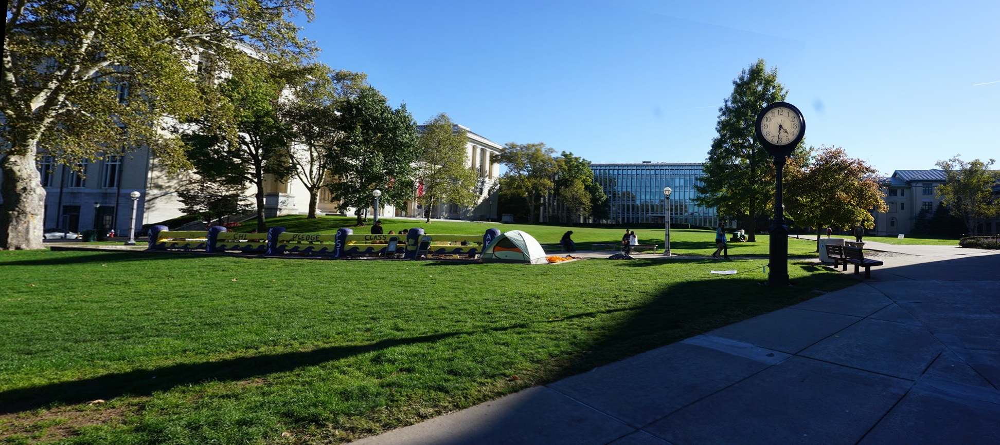

# panorama-stitching

Two-image panorama stitching from scratch with Python and OpenCV: SIFT features,
FLANN matching with Lowe's ratio test, RANSAC homography, perspective warping,
feather blending and automatic border cropping. Ships with a small zero-dependency
web UI (stdlib `http.server`) that runs the whole pipeline and shows every
intermediate step.

| Clock tower | School yard | Pont du Gard |
| --- | --- | --- |
|  |  |  |

## Pipeline

1. **Feature detection** (`Step1_Sift.py`, `panorama_pipeline.py`): grayscale conversion,
   `cv2.SIFT_create()`, keypoints and 128-d descriptors for both images.
2. **Matching** (`matcher.py`): FLANN kd-tree kNN (k=2) and Lowe's ratio test (0.7).
3. **Homography** (`homografi.py`): `cv2.findHomography` with RANSAC (reprojection
   threshold 5 px, minimum 10 matches), inlier visualization.
4. **Stitching** (`birlestirme.py`): canvas size from the warped corners, left image
   warped into the right image plane, feather blending in a narrow band around the
   overlap centre, iterative trimming of black borders.

Results on the bundled examples (single run on a laptop CPU):

| Example | Keypoints L / R | Good matches | RANSAC inliers | Output size |
| --- | --- | --- | --- | --- |
| Clock tower | 8 313 / 5 516 | 1 564 | 1 481 | 1925 x 867 |
| School yard | 7 641 / 10 041 | 828 | 800 | 3452 x 1200 |
| Pont du Gard | 7 588 / 10 684 | 3 857 | 3 838 | 1815 x 700 |

## Quickstart

```bash
git clone https://github.com/Onurkutan/panorama-stitching.git
cd panorama-stitching
python -m venv .venv
# Windows: .venv\Scripts\activate      macOS/Linux: source .venv/bin/activate
pip install -r requirements.txt
```

### Web UI

```bash
python app.py            # optional port: python app.py 8080
```

Open `http://127.0.0.1:8000`. Pick one of the bundled datasets or upload your own
left/right pair. The page shows the stitched panorama, SIFT keypoints for both inputs,
the raw matches and the RANSAC-filtered matches, plus keypoint / match / inlier counts.
Generated files are written to `web_outputs/<job-id>/` and uploads to `web_uploads/`.

### Command line

```bash
python Step1_Sift.py --headless            # all three example sets
python Step1_Sift.py --sets clock street   # a subset
python Step1_Sift.py --out /tmp/pano       # different output root
```

Each set is written to `outputs/<set>/` (panorama, keypoint images, raw and
RANSAC-filtered matches). Without `--headless` (or `HEADLESS=1`) the last panorama is
also shown in an OpenCV window. Failures such as too few matches are reported per set
and the remaining sets still run.

## Project layout

```
app.py                  stdlib HTTP server: static files, /api/examples, /api/stitch
panorama_pipeline.py    stitch_pair(): the pipeline shared by the web app and the CLI
Step1_Sift.py           CLI entry point over the example datasets
matcher.py              FLANN kNN matching + Lowe ratio test
homografi.py            RANSAC homography + inlier visualization
birlestirme.py          warping, feather blending, auto-crop
errors.py               PanoramaError raised by every stage on unusable input
index.html, static/     web UI (vanilla JS, no build step)
images/                 example image pairs and their stitched panoramas
```

Requirements: Python 3.10+, `opencv-python` 4.8+ (SIFT is included in the main
package since 4.4), `numpy`.

## Sample image credits

- `images/SchoolImage`: photographed by Onur Kutan.
- `images/Clock` (Carnegie Mellon University campus) and `images/test1` (Pont du Gard):
  third-party photographs used here for educational and demonstration purposes only.
  Copyright remains with their respective owners; they are not covered by this
  repository's license. Replace them with your own pairs if you reuse the project.

## Authors

- Onur Kutan ([@Onurkutan](https://github.com/Onurkutan))
- Ümit Sevil ([@expectation0](https://github.com/expectation0))
- Mustafa Yaman ([@mustafayymn](https://github.com/mustafayymn))
- Sudenaz Ustabaş ([@sudenazust](https://github.com/sudenazust))

The stitching pipeline started as a team project; its original repository is
[expectation0/Panorama-Stitching-CV](https://github.com/expectation0/Panorama-Stitching-CV).
This repository continues that work with the web UI, hardening and tooling.

## License

MIT, see [LICENSE](LICENSE).
