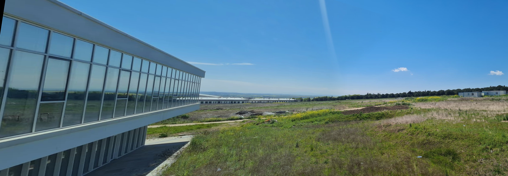
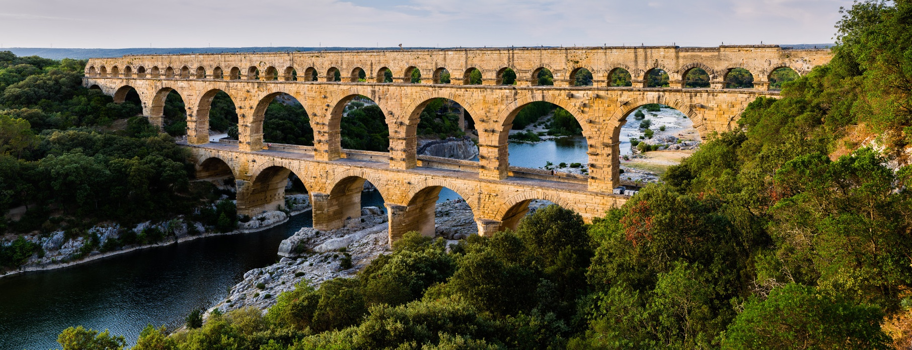
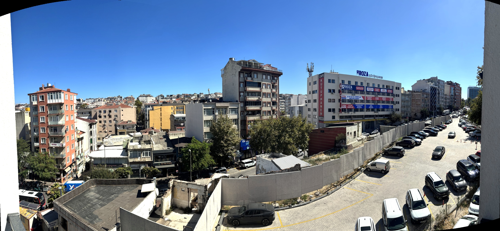

# panorama-stitching

[](https://github.com/Onurkutan/panorama-stitching/actions/workflows/ci.yml)

Panorama stitching from scratch with Python and OpenCV: SIFT features, FLANN matching
with Lowe's ratio test, RANSAC homographies, cylindrical projection for wide sweeps,
perspective warping, exposure matching, seam feathering and automatic border cropping.
Two to six photos in any order: the arrangement is recovered from the pairwise matches.
Ships with a small web UI (English / Turkish) that stitches your own photos or the
bundled demo sets, shows every intermediate step, and runs either against a tiny stdlib
server or entirely inside the browser.

| Clock tower | School yard | Pont du Gard |
| --- | --- | --- |
|  |  |  |

Six hand-held phone photos, given in any order, stitched on a cylinder:



## Live demo

[onurkutan.github.io/panorama-stitching](https://onurkutan.github.io/panorama-stitching/)
runs the very same Python modules inside the browser through
[Pyodide](https://pyodide.org) (CPython and OpenCV compiled to WebAssembly), so no server
is involved and uploaded photos never leave your machine. The first visit downloads about
20 MB of runtime; after that a pair stitches in a few seconds. Inputs are downscaled to
1400 px on the long side there. The computation runs in a Web Worker, so the page stays
responsive, shows the pipeline stage it is in, and a run can be cancelled. The page
detects whether the Python server is available and otherwise switches to the in-browser
pipeline, so the same `index.html` and `static/` serve both.

## Pipeline

1. **Feature detection** (`panorama_stitching/features.py`): grayscale conversion,
   `cv2.SIFT_create()`, keypoints and 128-d descriptors for every photo.
2. **Matching** (`panorama_stitching/matching.py`): FLANN kd-tree kNN (k=2) and Lowe's
   ratio test (0.7).
3. **Homography** (`panorama_stitching/homography.py`): `cv2.findHomography` with RANSAC
   (reprojection threshold 5 px, minimum 10 matches), inlier visualization.
4. **Arrangement** (`panorama_stitching/pipeline.py`, sets of more than two photos): every
   pair is matched, the pairs form a graph weighted by RANSAC inliers, its maximum
   spanning tree keeps only the strongest overlaps, the tree centre becomes the reference
   frame and every other photo's homography is chained along the tree. Photos can be
   given in any order and in any layout the tree can express (a row, a column, a grid).
5. **Projection** (`panorama_stitching/projection.py`): a flat canvas cannot hold a wide
   sweep (a photo 80-90 degrees away from the reference stretches towards infinity), so
   sets of three or more photos are projected onto a cylinder first. The focal length is
   estimated from the tree-edge homographies (Szeliski's focals-from-homography, median
   over the edges; within about 2% of the EXIF value on the test photos), every photo is
   warped onto the cylinder with a validity mask, the tree edges are matched again on the
   cylinder and the chained transforms stay bounded. Two photos keep the planar path, so
   their output is unchanged; `projection="planar"` or `"cylindrical"` overrides the
   automatic choice.
6. **Stitching** (`panorama_stitching/blending.py`): one canvas from all warped corners
   (degenerate homographies are rejected before anything is allocated), photos warped into
   the reference plane with eroded validity masks so the interpolation fringe never counts
   as content, per-channel exposure matching on each overlap, feather blending in a band
   around the seam that runs equidistant from the two borders (moving subjects stay
   unblended outside it), composition outward from the reference, and trimming of the
   black borders.

Results on the bundled examples (FLANN and RANSAC are seeded, so the numbers are
reproducible; about 2 s per pair on a laptop CPU):

| Example | Keypoints L / R | Good matches | RANSAC inliers | Output size |
| --- | --- | --- | --- | --- |
| Clock tower | 8 313 / 5 516 | 1 571 | 1 490 | 1944 x 867 |
| School yard | 7 641 / 10 041 | 816 | 795 | 3440 x 1200 |
| Pont du Gard | 7 588 / 10 684 | 3 846 | 3 828 | 1812 x 696 |

The six-photo balcony sweep (1600 px inputs) uses 5 of the 15 evaluated pairs,
11 694 RANSAC inliers on those pairs, and produces a 3262 x 1512 cylindrical panorama in
about 10 s.

## Quickstart

```bash
git clone https://github.com/Onurkutan/panorama-stitching.git
cd panorama-stitching
python -m venv .venv
# Windows: .venv\Scripts\activate      macOS/Linux: source .venv/bin/activate
pip install -r requirements.txt      # or: pip install -e ".[dev]"
```

### Web UI

```bash
python app.py            # optional port: python app.py 8080
```

Open `http://127.0.0.1:8000`. **Your photos** takes two to six overlapping photos in any
order (drag and drop or file picker, about 30-50% overlap between neighbours) and returns
a downloadable panorama; **Demo sets** runs one of the bundled sets (three pairs and the
six-photo sweep) with one click. Both
show the SIFT keypoints of every photo, the raw and the RANSAC-filtered matches of every
pair the arrangement uses, the detected left-to-right order and the keypoint / match /
inlier counts. The interface is English by default and available in Turkish (toggle in
the header). Generated files are written to `web_outputs/<job-id>/` and uploads to
`web_uploads/`; job folders older than a day are removed automatically. Uploads are
capped at 40 MB per request and inputs larger than 2400 px on the long side are
downscaled before processing (the status line says so).

### Command line

```bash
python -m panorama_stitching.cli photo1.jpg photo2.jpg photo3.jpg   # your own photos, any order
python -m panorama_stitching.cli *.jpg --projection planar          # force a projection
python -m panorama_stitching.cli --headless            # all bundled demo sets
python -m panorama_stitching.cli --sets clock balcony  # a subset of the demo sets
python -m panorama_stitching.cli --out /tmp/pano       # different output root
```

(`panorama-stitch` is the same entry point after `pip install -e .`.) Your own photos
are written to `outputs/custom/` as `panorama.jpg`, `keypoints_<k>.jpg`,
`matches_<i>_<j>.jpg` and `ransac_<i>_<j>.jpg` (`--name` changes the folder); each demo
pair goes to `outputs/<set>/` as `panorama.jpg`, `left_keypoints.jpg`,
`right_keypoints.jpg`, `matches.jpg` and `ransac_inliers.jpg`, and the six-photo demo set
uses the same per-photo naming as your own photos. Without `--headless` (or `HEADLESS=1`)
the last panorama is also
shown in an OpenCV window. Failures such as too few matches are reported per set and the
remaining sets still run.

From Python:

```python
from panorama_stitching import stitch_pair, stitch_set

# any number of photos (2 to 6) in any order; projection="auto" picks the
# cylinder for three or more photos and the plane for a pair
result = stitch_set(
    ["a.jpg", "b.jpg", "c.jpg"],
    "out/",
    max_side=2400,
    progress=lambda stage, step, total: print(f"{step}/{total} {stage}"),
)
m = result["metrics"]
print(m["order"], m["projection"], m["focalPx"], m["pairs"], result["files"])

# the classic two-image call (left photo on the left)
pair = stitch_pair("left.jpg", "right.jpg", "out/")
```

Both raise `PanoramaError` with a stable `code` (for example `not_enough_matches`,
`image_not_connected`) and, when relevant, `details` naming the photos involved.

## Development

```bash
pip install -r requirements-dev.txt
ruff check . && ruff format --check .
pytest
```

## Project layout

```
panorama_stitching/     the package
  features.py             SIFT keypoints and descriptors
  matching.py             FLANN kNN matching + Lowe ratio test
  homography.py           RANSAC homography + inlier visualization
  blending.py             validity masks, exposure matching, seam feathering, auto-crop
  projection.py           focal estimate and cylindrical warp for wide sweeps
  pipeline.py             stitch_pair() / stitch_set(): the pipeline shared by the web app and the CLI
  cli.py                  command line entry point for your photos or the demo sets
  errors.py               PanoramaError (with a stable .code and .details) on unusable input
app.py                  stdlib HTTP server: static files, /api/examples, /api/stitch
index.html, static/     web UI (vanilla JS, no build step, English / Turkish); worker.js runs
                        the pipeline in the browser through Pyodide
tests/                  pytest suite (synthetic images plus downscaled real sets)
images/                 demo sets (three pairs, one six-photo sweep) and their panoramas
```

## Limitations and ideas

- Homographies assume a rotating camera or a distant scene; strong parallax (close
  objects with camera translation) cannot be aligned by any 3x3 warp.
- The cylinder assumes one focal length for the whole set (no zooming between shots)
  and a horizontal sweep; a spherical projection would also handle tilting up and down.
- Two photos are still stitched on a plane, which is fine up to roughly 100 degrees of
  combined field of view.
- Chained homographies accumulate small errors along the tree; bundle adjustment would
  refine all of them jointly.
- HEIC photos (the iPhone default) are decoded by the server and the CLI when the optional
  extra is installed (`pip install -e ".[heic]"`, or `pip install pillow-heif`); without it
  they are rejected with a clear message. The in-browser demo can only use HEIC in Safari;
  elsewhere export the photos as JPEG (iPhone: Settings > Camera > Formats > Most
  Compatible).
- Blending is a feather band along a fixed geometric seam. Seam finding
  (`cv2.detail_DpSeamFinder`) or multi-band blending would hide misalignments better.

Requirements: Python 3.10+, `opencv-python` 4.8+ (SIFT is included in the main
package since 4.4), `numpy`; optionally `pillow-heif` for HEIC input (`pip install -e
".[heic]"`).

## Sample image credits

- `images/SchoolImage` and `images/BalconySweep`: photographed by Onur Kutan.
- `images/Clock` (Carnegie Mellon University campus) and `images/test1` (Pont du Gard):
  third-party photographs used here for educational and demonstration purposes only.
  Copyright remains with their respective owners; they are not covered by this
  repository's license. Replace them with your own pairs if you reuse the project.

## Origin

The stitching pipeline started as a university team project
([expectation0/Panorama-Stitching-CV](https://github.com/expectation0/Panorama-Stitching-CV)).
This repository is maintained by Onur Kutan and continues that work with the web UI,
hardening, tests and tooling.

## License

MIT, see [LICENSE](LICENSE).
